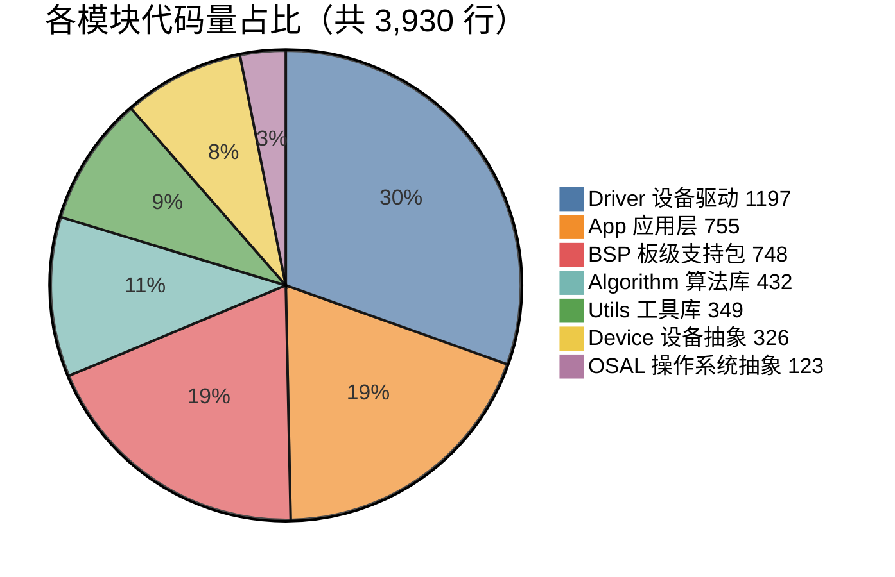
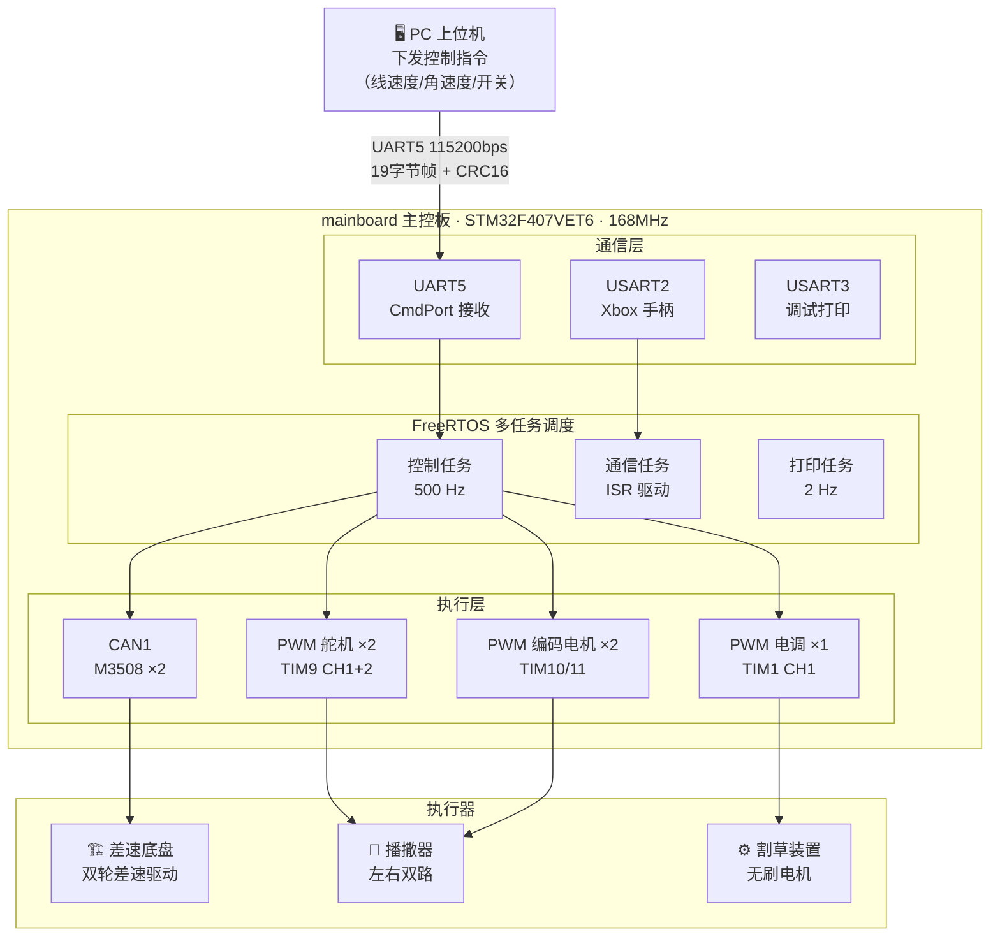
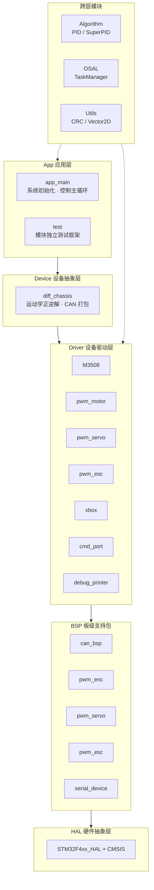
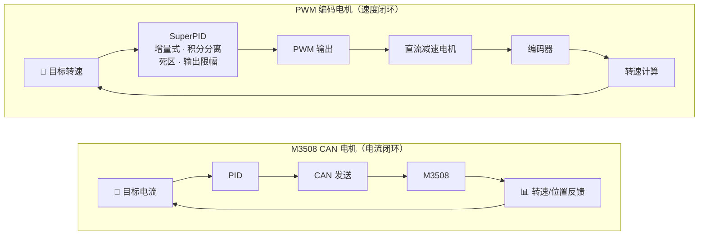
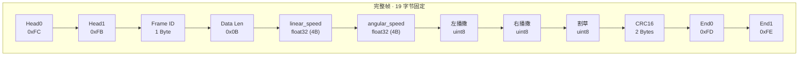
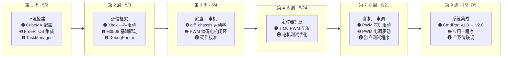

# mainboard 农业机器人嵌入式控制平台

## 个人工作量报告

---

**作者**：唐  
**开发周期**：2026 年 5 月 2 日 — 7 月 5 日（9 周）  
**平台**：STM32F407VET6 + FreeRTOS（CMSIS_V2）  

---

## 一、项目概述

mainboard 是一款面向农业场景的智能机器人嵌入式控制平台，从零构建完整固件，实现差速轮式底盘运动控制、左右双路播撒装置、割草装置、远程指令接收、Xbox 手柄操控五大功能。

---

## 二、工作量量化

### 2.1 代码规模

| 类别 | 文件数 | 代码行数 |
|------|--------|----------|
| 手写应用代码（mainboard_FW/） | 40 | **3,930** |
| STM32 CubeMX 配置代码（Core/） | 18 | **3,791** |
| 设计文档 | 5 | **~1,700** |

Git 统计：**净新增 +5,331 行**（44 个文件变更），**14 次提交**。

### 2.2 模块划分

### 2.3 硬件外设配置

| 外设类型 | 数量 | 说明 |
|----------|------|------|
| CAN 总线 | 1 路 | M3508 电机通信（1 Mbps） |
| UART 串口 | 6 路 | 调试/手柄/远程命令/预留 |
| 定时器（编码器模式） | 4 路 | 正交编码器硬件解码 |
| 定时器（PWM 输出） | 10 路 | 舵机/电机/电调驱动 |
| GPIO 引脚 | 44+ | — |

> 共配置 **23 个 MCU 内部 IP**，使用了 STM32F407VET6 几乎全部定时器资源。

---

## 三、系统架构设计

### 3.1 总体结构

### 3.2 软件五层架构

### 3.3 设计要点

**面向对象抽象**
- `SerialDevice` 抽象基类：UART 中断统一分发，新增协议只需继承并重写一个方法
- `ITaskProcessor` 纯虚接口：业务模块与 FreeRTOS 调度解耦，通过 `TaskManager` 声明式注册
- `diff_chassis` 双重构造模式：外部注入（便于测试）或指定 ID 内部创建（便于集成）

**设计模式**
- 策略模式：`ITaskProcessor` 多态注册到不同任务槽
- 模板方法：`SerialDevice` 定义中断接收流程，子类实现协议解析
- RAII：所有驱动对象禁用拷贝，析构自动释放资源

**双闭环控制**

---

## 四、通信协议设计

### 4.1 CmdPort 协议 v2.0

**特性**
- 数据段 CRC-16/XMODEM 校验，多项式 0x1021
- 9 状态有限状态机解析，任何异常自动回退重新同步
- 设计手册完整（470 行），含 Python 上位机参考实现

---

## 五、Git 开发记录

### 5.1 提交历史（14 次）

| 日期 | 提交信息 | 说明 |
|------|----------|------|
| 5/2 | `init: first commit` | 工程初始化（CubeMX 生成 + FreeRTOS 集成） |
| 5/3 | `refactor: 重构设备驱动模块并添加调试打印功能` | 代码结构整理、DebugPrinter 框架 |
| 5/3 | `fix(xbox): 修正手柄按键映射顺序和数据解析注释` | Xbox 手柄驱动纠错 |
| 5/3 | `feat(test): 添加 Xbox 控制器支持到 M3508 测试应用` | 手柄 + 电机联调 |
| 5/4 | `feat(device): 新增差速底盘设备类及测试程序` | diff_chassis 模块 |
| 5/4 | `feat(pwm_motor): 新增PWM电机驱动与测试框架` | 编码器 + PID 闭环 |
| 5/4 | `refactor(test): 移除重复的全局变量声明并调整头文件包含` | 代码质量优化 |
| 5/4 | `fix(BSP): 修正电机的PWM定时器通道和方向` | 硬件映射校验 |
| 5/24 | `feat(pwm/tim): 完善TIM8 PWM配置并优化电机测试功能` | TIM 扩展 |
| 6/21 | `feat: add PWM servo driver and incremental test for servo A` | 舵机驱动 |
| 6/21 | `feat(esc): 新增PWM电调驱动与测试程序` | 电调/割草驱动 |
| 7/2 | `feat(app): 新增应用主程序及命令端口类` | 系统集成 + CmdPort v1.0 |
| 7/2 | `feat(cmd_port): 扩展数据结构，新增右侧播撒器和割草` | 协议 v2.0 扩展 |
| 7/5 | `feat(app): 添加右侧播撒器和割草功能，重构控制逻辑` | 功能完成 |

### 5.2 开发时间线

### 5.3 代码变更

44 个文件变更，+5,331 行新增，-209 行删除。

| 变更类型 | 文件 |
|----------|------|
| 新增模块 | `app_main` · `cmd_port` · `diff_chassis` · `pwm_motor` · `pwm_servo` · `pwm_esc` · `xbox` · `debug_printer` · `pwm_enc_bsp` · `pwm_esc_bsp` · `pwm_servo_bsp` |
| 重构模块 | `M3508`（CAN 电机驱动） · `Serial_device`（串口抽象基类） · `test`（测试框架） |
| 配置扩展 | `Core/tim.c`（+364 行 TIM 配置） · `Core/freertos.c`（任务调度调整） |

---

## 六、产出物汇总

| 类别 | 数量 |
|------|------|
| 手写代码 | 3,930 行 / 40 文件 |
| 配置代码 | 3,791 行 / 18 文件 |
| 软件模块 | 7 大模块 / 20+ 子模块 |
| 硬件外设 | 23 个 IP / 44+ 引脚 |
| Git 提交 | 14 次 |
| 设计文档 | 5 份 |
| 协议设计 | CmdPort v2.0（19 字节帧 + CRC16）+ Python 参考实现 |
| 测试覆盖 | 7 项独立测试 + 全系统模拟注入 |

---

**日期**：2026 年 7 月 10 日
