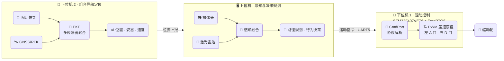

# mainboard 项目整体框架

```mermaid
flowchart LR
    %% ── 上位机 ──
    subgraph HOST["🖥 上位机 · 感知与决策规划"]
        direction LR
        CAM("📷 摄像头") --> PLAN("🧠 感知融合")
        LIDAR("📡 激光雷达") --> PLAN
        PLAN --> DECIDE("🎯 路径规划 · 行为决策")
    end

    %% ── 控制下位机 ──
    subgraph CTRL["🔧 下位机 1 · 运动控制<br/>STM32F407VET6 + FreeRTOS"]
        direction LR
        CMD("📨 CmdPort<br/>协议解析") --> CHASSIS("🏗 PWM 差速底盘<br/>左 A 口 · 右 D 口")
    end

    %% ── 导航下位机 ──
    subgraph NAV["📍 下位机 2 · 组合导航定位"]
        direction LR
        IMU("📐 IMU 惯导") --> FUSE("🔗 EKF<br/>多传感器融合")
        GNSS("🛰 GNSS/RTK") --> FUSE
        FUSE --> POSE("📊 位置 · 姿态 · 速度")
    end

    %% ── 数据流 ──
    HOST -- "运动指令 · UART5" --> CTRL
    NAV -- "位姿上报" --> HOST

    %% ── 执行器 ──
    CHASSIS --> WHEEL("🛞 驱动轮")
```

> 上位机负责感知融合与决策规划；控制下位机（本工程）负责 PWM 差速底盘运动控制；组合导航下位机负责实时位姿估计。三者通过 UART 串行总线互联。
